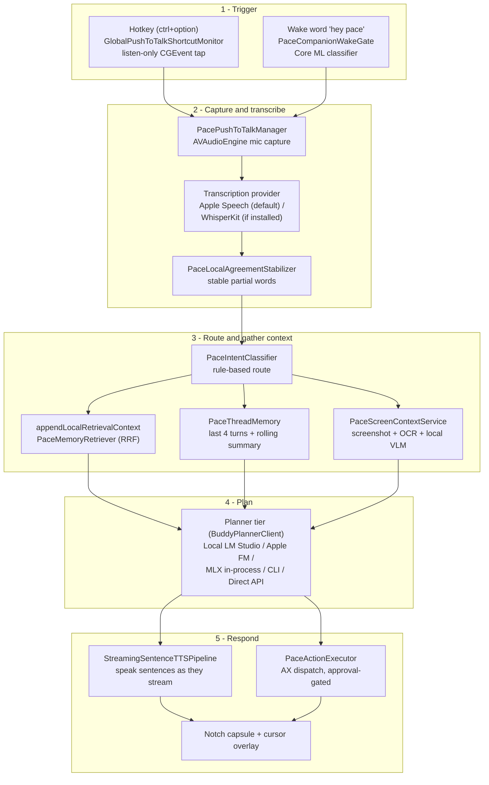

# How Pace works, end to end

This is a **learning-oriented** walkthrough of Pace for someone trying to
understand the system, not a per-system spec. It follows a single interaction
from the moment you speak to the moment Pace answers, naming the real components
on the way and pausing on the design decisions that shaped them.

If you want the terse per-system reference instead, read
[`systems.md`](systems.md). For the doctrine (latency budget, "steal from
anywhere that runs local") and the constellation diagram, read
[`overview.md`](overview.md). For a per-file map, read
[`../development/key-files.md`](../development/key-files.md). This page links to
those rather than repeating them.

## The one-sentence version

Pace is a macOS **menu-bar-only** voice agent (`LSUIElement=true`, no dock icon,
no main window). You hold a hotkey or say a wake word, Pace transcribes your
speech on-device, optionally reads your screen and your local memory, plans with
a local reasoner, and streams a spoken answer back — optionally executing
approved macOS actions. **Every byte stays on your Mac.** That privacy posture is
not a feature; it is the constraint the whole architecture is built to protect
(see [`overview.md`](overview.md) → "Zero-cloud rule").

## The five stages

Every interaction moves through the same five stages. Not every stage fires on
every turn — a pure dictation ("type hello") skips the planner entirely — but
this is the spine.

## Stage 1 — trigger: how Pace knows you are talking to it

There are two ways to start a turn, and both are deliberately cheap and local.

**Push-to-talk (default).** A system-wide hotkey (`ctrl+option`) is watched by
`GlobalPushToTalkShortcutMonitor`, which installs a **listen-only `CGEvent`
tap** rather than an AppKit global monitor. The reason is reliability:
modifier-only chords like `ctrl+option` are detected far more consistently
through a CGEvent tap while the app runs in the background. Press starts
recording; release ends it.

**Wake word (opt-in, Always-On Companion Mode).** When the always-on mode is
enabled, `PaceCompanionWakeGate` runs a tiny bundled Core ML classifier
(`PaceWakeWordClassifier.mlpackage`, 2.5 MB) over a bounded two-second PCM ring
buffer. The classifier emits exactly two labels, `hey_pace` and `background`,
and only an accepted wake — two consecutive high-confidence windows above the
`0.986` threshold — releases the mic and hands off to the normal push-to-talk
conversation path. Two design decisions matter here:

- **It runs *before* Apple's Speech framework is ever reachable.** The point of
  a local keyword gate is that raw audio is not streamed into a recognizer (or
  anywhere else) until a wake is confirmed. Missing or malformed model assets
  **fail closed** — no wake, no capture — rather than degrading into
  always-listening.
- **The model is bundled, not fetched.** No ONNX runtime, no Python, no network
  call. The full contract (input shape, threshold, training corpus, honest
  recall numbers) lives in
  [`../product/pace-wake-word-classifier.md`](../product/pace-wake-word-classifier.md).

Companion Mode is **default off** and every capture source is separately
consented; the data boundaries are documented in
[`../product/companion-mode-privacy.md`](../product/companion-mode-privacy.md).

## Stage 2 — capture and transcribe

Once a turn starts, `PacePushToTalkManager` owns the microphone via
`AVAudioEngine` and feeds audio into a **pluggable transcription provider**
(`BuddyTranscriptionProvider`). The default is Apple's `SFSpeechRecognizer` with
`requiresOnDeviceRecognition=true` — instant, no model download, on-device.
`WhisperKitTranscriptionProvider` is auto-preferred *if* its ~1.5 GB Core ML
model is already on disk (the install being the user's opt-in signal); otherwise
it cleanly falls back to Apple Speech. **All cloud STT providers have been
removed** — there is no code path that sends audio off the Mac.

While you are still speaking, partial hypotheses flow through
`PaceLocalAgreementStabilizer`, which publishes only the word prefixes that
*agree across consecutive hypotheses* and never retracts stable text. This is
what lets downstream stages start working on a partial transcript without
flickering — and it is what the speculative fast-action path keys off of.

## Stage 3 — route and gather context

A finalized (or stable-partial) transcript hits `PaceIntentClassifier`, a **tiny
rule-based local classifier** — no model call. It routes the turn into one of a
handful of lanes (chitchat, pure knowledge, screen description, screen action,
phone-large-model, unknown). This is a latency lever: chitchat gets a canned
reply, pure-knowledge turns skip the screenshot entirely and use a text-only
planner path, and only screen-referential turns pay for vision.

For turns that need context, three sources are assembled in parallel:

- **Local retrieval** (`appendLocalRetrievalContext` →
  `PaceMemoryRetriever`). Pace maintains a local index over **sixteen retrieval
  sources** (`PaceRetrievalSource`): files, Mail, Notes, Calendar, Reminders,
  Contacts, past Pace history, screen-watch and app-usage journals, research
  history, screen-time, local preferences, episodic and companion memory, and
  meeting notes. The retriever fuses a **semantic (cosine) ranking** with a
  **keyword (BM25) ranking** using Reciprocal Rank Fusion (`k0=60`), so an entry
  that is a near-semantic match *and* shares a rare keyword ranks above either
  signal alone. When embeddings are unavailable it falls back cleanly to keyword
  recall. Embeddings themselves come from a fallback chain
  (`PaceChainedTextEmbeddingClient`): in-process MLX or LM Studio when present,
  Apple's `NLEmbedding` always available as the floor — so semantic recall keeps
  working on a clean Mac with no extra install.

- **Conversation memory** (`PaceThreadMemory`). Every planner call carries the
  last **K=4 turns verbatim** plus a **rolling summary** of everything older,
  injected into the system prompt. The summary is refreshed off the hot path by
  a detached Apple FM call, so the user-facing turn never blocks on
  summarization, and the whole thread survives quit/relaunch via an atomic
  on-device JSON snapshot. The full mental model lives in
  [`../product/conversation-model.md`](../product/conversation-model.md);
  durable facts graduate to episodic memory instead.

- **Screen context** (`PaceScreenContextService`), only when the turn is
  screen-referential. It captures the cursor screen via ScreenCaptureKit, runs
  Apple Vision OCR for verbatim text fidelity, optionally sends the screenshot
  to a local VLM (UI-Venus / Qwen3-VL over loopback LM Studio, or in-process
  MLX), and merges the element map by bounding-box overlap. A per-screen cache
  keyed on a pixel fingerprint means an unchanged screen is a free hit.

## Stage 4 — plan

The gathered prompt goes to the **active planner**, chosen by the user in
Settings → Planner via `PacePlannerTier` behind the `BuddyPlannerClient`
protocol. The default on a fresh install resolves to **Apple Foundation Models**
when Apple Intelligence is available (zero external install, talk to Pace
immediately) and **Local LM Studio** (`qwen3-30b-a3b`) otherwise; existing users
keep whatever tier they pinned. Power users can also run a fully **in-process
MLX** planner, and there are consent-gated off-device tiers (CLI bridge, CLI
direct-spawn, BYO-key Direct API) for people who explicitly opt in.

Two design decisions define this stage:

- **The output is decode-constrained JSON.** The main action planner is pinned
  to the v10 `{spokenText, intent, payload}` envelope via
  `response_format: json_schema`. The model *cannot* emit malformed JSON or an
  unknown action name — that is a guarantee from the decode layer, not a runtime
  check.
- **The loop is single-shot, then observe.** `CompanionManager`'s
  plan-act-observe loop re-screenshots and re-plans across steps until the
  planner emits `[DONE]` or runs out of tool calls (capped at `AgentMaxSteps`,
  default 8). Pace deliberately does **not** run open-ended ReAct multi-turn
  agentic loops — they are latency-killing (see [`overview.md`](overview.md) →
  "What we are NOT doing").

The speculative-planner race — running a fast Apple FM "lite" planner
concurrently with the full VLM-fed planner and letting whichever streams first
win the audio — is the headline latency lever and is documented in
[`systems.md`](systems.md) → "Speculative planner race."

## Stage 5 — respond

The planner streams text back token by token. Rather than wait for the full
response, `StreamingSentenceTTSPipeline` dispatches **complete sentences to TTS
as they arrive**, cutting perceived time-to-first-spoken-word from ~3 s to
~500 ms. TTS itself is on-device: a loopback Kokoro sidecar by default, falling
back per-utterance to Apple's `AVSpeechSynthesizer` if the sidecar is down, so a
missing sidecar costs nothing.

If the turn carried actions and `EnableActions=true`, `PaceActionExecutor`
dispatches them **AX-first** (`AXPress`, `setValue`), falling back to CGEvent
keyboard synthesis — never the clipboard, because pasteboard pollution is a real
user pain point Pace refuses to inherit. Reversible mutations raise a 5-second
floating undo banner; higher-risk actions are approval-gated with a
Cancel-default alert. Meanwhile the notch capsule and cursor overlay show turn
state, and any off-device planner tier tints the capsule amber and writes an
audit-log line so the user always sees when a byte leaves the Mac.

## Why on-device, and why it shapes everything

The privacy posture is the product's headline differentiator, so it is enforced
structurally, not by policy:

- **No cloud egress by default.** `PaceLocalEndpointGuard` refuses any
  planner/VLM HTTP root that is not loopback (`localhost`, `127.0.0.0/8`, `::1`),
  falling back to localhost rather than sending data to a remote or LAN host.
- **Off-device tiers are loud, not silent.** The three opt-in off-device planner
  tiers each require consent plus a 24-hour soak, tint the capsule amber, write
  a `PaceAPIAuditLog` entry (char-counts only, never content), and fail loud
  instead of silently falling back.
- **Secrets never touch disk in the clear.** Direct-API keys live only in the
  macOS Keychain via `PaceKeychainStore` — never UserDefaults, never a plist,
  never a log line.

The other pervasive design pressure is **latency**: the end-to-end target is
100 ms perceived feedback for the lightest action. That is why the intent
classifier routes before any model runs, why partials drive downstream work, why
the planner output is streamed sentence-by-sentence into TTS, and why the
speculative race exists. The full latency budget — measured versus targeted, per
pipeline stage — is in [`overview.md`](overview.md) → "100 ms per step."

## Where to go next

- [`overview.md`](overview.md) — doctrine, constellation diagram, latency
  budget, zero-cloud rule.
- [`systems.md`](systems.md) — canonical per-system reference (planner tiers,
  memory, actions, watch mode, meeting notes, the speculative race).
- [`../development/key-files.md`](../development/key-files.md) — every source
  file with its purpose and line count.
- [`../product/conversation-model.md`](../product/conversation-model.md) — the
  two-tier in-context memory model.
- [`../product/companion-mode-privacy.md`](../product/companion-mode-privacy.md)
  and [`../product/pace-wake-word-classifier.md`](../product/pace-wake-word-classifier.md)
  — the always-on wake path and its data boundaries.
