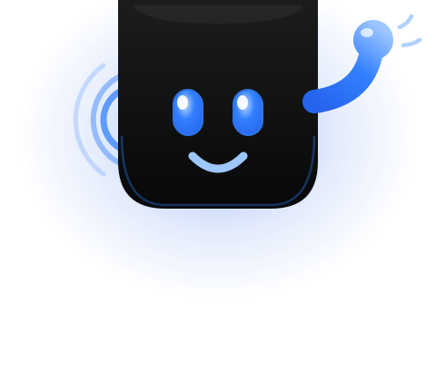

# Pace brand — the mascot

The Pace mascot is **the notch itself, come alive.**

Pace lives in the MacBook menu-bar/notch surface — a black capsule that extends
the notch downward (`PaceMenuBarOverlay`). The mascot takes that exact surface
and gives it a face: two glowing blue eyes, a soft smile, and a little wave. It
isn't a robot or an animal bolted onto the product — it *is* the product's home
on your screen, looking back at you.

This was a deliberate choice over the alternatives (an anthropomorphized cursor,
an abstract orb, a capsule-blob creature): the notch is the one surface every
Pace user already stares at, so the mascot reinforces "that black bar at the top
is alive and listening" instead of introducing a separate character to learn.

## Files

| File | Use |
|------|-----|
| `pace-mascot.svg` | Standalone character (480×420, transparent). Stickers, social avatars, favicon source, in-app About screen. |
| `pace-mascot-hero.svg` | Wide banner (1200×600) with menu-bar context + `Pace` wordmark + tagline. README header, landing-page hero, OG image source. |

Both are hand-authored vector — no asset pipeline, crisp at any size. GitHub
renders them inline. For raster/OG exports (PNG), render with `rsvg-convert`
or `cairosvg` (not bundled; ask before installing).

## Anatomy

- **Body** — the notch capsule, near-black vertical gradient (`#1A1D1C → #101211 → #070807`), descending from the top screen edge with a rounded chin. A faint blue rim-light traces the chin.
- **Eyes** — tall rounded pills, brand-blue radial glow (`#BFD9FF → #3380FF → #2563EB`) with a white catch-light. Same friendly eyes as the shipped in-app walking avatar (`PaceAvatarOverlay`).
- **Smile** — a single light-blue (`#9EC7FF`) curved stroke, round caps.
- **Wave** — a blue gradient arm with a rounded hand and two motion ticks. Says "hi, I'm here" — the companion gesture, not a salute.
- **Voice waves** — three concentric arcs on the left, fading outward. Signals "listening / speaking" without words.
- **Halo** — a soft blue presence glow, the ambient-companion ("Her"-arc) cue.

## Palette

Pulled verbatim from `DesignSystem.swift` (`DS.Colors`) so the mascot and the app never drift:

| Token | Hex | Where |
|-------|-----|-------|
| Body / background | `#101211` | notch fill, dark card |
| Accent | `#2563EB` | eye core, deepest blue |
| Overlay cursor blue | `#3380FF` | eye glow, voice arcs, rim light |
| Light blue | `#9EC7FF` | smile, highlights, arm tip |
| Text primary | `#ECEEED` | wordmark |
| Text secondary | `#ADB5B2` | tagline |
| Success green | `#34D399` | (hero menu-bar battery only) |

## Voice

Tagline in the hero: **"your Mac, listening — fully on-device."** It carries the
two headline claims (ambient presence + the on-device moat) in five words.

## Name

Working name: **TBD** — the character ships unnamed. Candidate directions if you
want one: *Pip* (small, friendly notch-dweller), *Vox* (it listens/speaks), or
just *"the Pace notch."* Pick one and this doc becomes its home.
